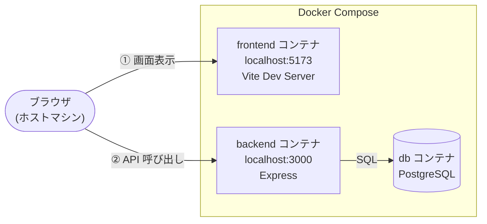
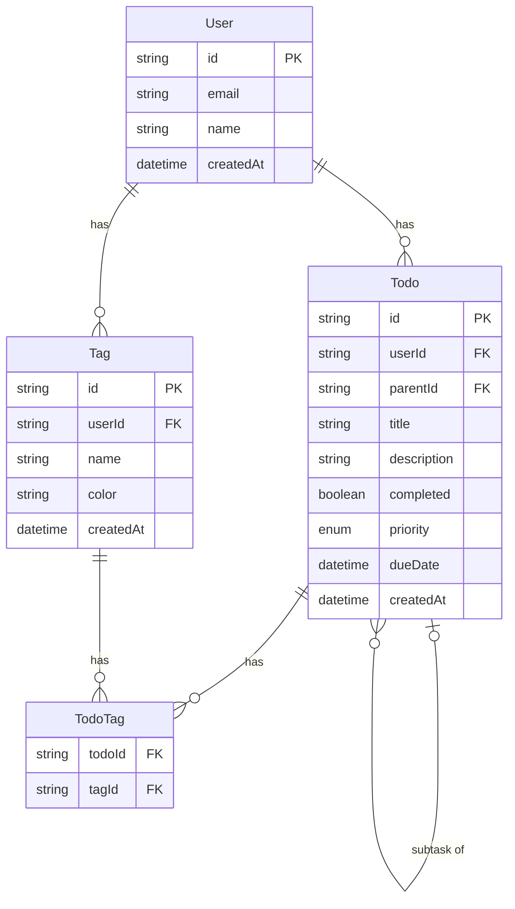

# TODO App

> タイトル・優先度・期日・タグ・サブタスクを管理できる、AWS フルサーバーレス構成の TODO アプリ

[](https://github.com/shii3011/TodoApp/actions)
[](https://www.typescriptlang.org/)
[](https://react.dev/)
[](https://aws.amazon.com/)
[](LICENSE)

---

## 目次

- [デモ](#デモ)
- [主な機能](#主な機能)
- [技術スタック](#技術スタック)
- [アーキテクチャ](#アーキテクチャ)
- [DB スキーマ](#db-スキーマ)
- [ローカル開発](#ローカル開発)
- [テスト](#テスト)
- [セキュリティ](#セキュリティ)
- [本番 AWS 構成](#本番-aws-構成)
- [API リファレンス](#api-リファレンス)
- [設計の方針](#設計の方針)
- [ハマった点・トラブルシューティング](#ハマった点トラブルシューティング)
- [ライセンス](#ライセンス)

---

## デモ

> スクリーンショットまたはデモ GIF をここに追加予定

本番 URL: `https://your-cloudfront-url.cloudfront.net`

---

## 主な機能

- **TODO 管理** — タイトル・詳細・優先度（high/medium/low）・期日を設定
- **サブタスク** — TODO を階層分割して管理（同一テーブルの自己参照）
- **タグ** — カラー付きタグで複数プロジェクトを横断管理
- **期日アラート** — 期限超過・当日の TODO を視覚的に強調表示
- **検索・フィルター** — キーワード検索・完了状態・優先度・タグでの絞り込み
- **認証** — AWS Cognito によるユーザー認証（JWT）

---

## 技術スタック

| 領域 | 採用 | 選定理由 |
|------|------|---------|
| **バックエンド** | Express / TypeScript | `serverless-http` 1 行で Lambda に載せられ構成の自由度が高い。NestJS はデコレーターベースで小規模構成に過剰 |
| **ORM** | Prisma | スキーマ・マイグレーション・型生成を一元管理。TypeORM はデコレーター依存でスキーマが分散しやすい |
| **バリデーション** | Zod | `z.infer<>` でスキーマから TypeScript 型を自動生成。ランタイム検証と型安全を 1 スキーマで完結 |
| **フロントエンド** | React 19 / Vite | 静的ホスティング（S3 + CloudFront）完結の SPA 要件。Next.js は SSR 不要な構成には過剰 |
| **サーバー状態管理** | TanStack Query | ローディング・エラー・キャッシュ無効化を宣言的に解決。Redux はボイラープレートが多くサーバーデータ管理に不向き |
| **CSS** | CSS Modules | Vite 標準機能でゼロ設定、クラス名衝突をコンパイル時に解消 |
| **認証** | AWS Cognito + aws-jwt-verify | 公式ライブラリで JWT 検証を自前実装せずに完結。Firebase Auth は GCP 依存で AWS 構成に不向き |
| **DB** | Neon (PostgreSQL) | サーバーレス PostgreSQL でアイドル時コストゼロ。Prisma の接続文字列変更のみで RDS/Aurora へ移行可能 |
| **インフラ** | AWS CDK (TypeScript) | バックエンドと同じ TypeScript でインフラを定義。Terraform は HCL という別言語の習得が必要 |
| **ホスティング** | Lambda + API Gateway | リクエスト単位の課金でアイドル時コストゼロ。ECS は常時稼働コストが発生 |
| **配信** | CloudFront + S3 | OAC で S3 への直接アクセスを禁止し CloudFront 経由のみ許可。インフラ全体を CDK で一元管理 |

---

## アーキテクチャ

### 本番環境（AWS）

リクエストは **① SPA 取得** と **② API 呼び出し** の 2 経路に分かれます。


### ローカル開発環境（Docker Compose）

3 つのコンテナが起動します。ブラウザはフロントエンドとバックエンドに**直接**アクセスします。



> **E2E テスト時のみ**: `VITE_API_PROXY_TARGET` を設定すると、ブラウザ → Vite → backend コンテナ の経路に切り替わります（Docker 内部 DNS の解決のため）。

---

## DB スキーマ



---

## ローカル開発

### 起動

```bash
docker compose up --build
```

| サービス | URL |
|---------|-----|
| フロントエンド | http://localhost:5173 |
| バックエンド API | http://localhost:3000 |

環境変数はすべて `docker-compose.yml` で管理しているため、`.env` ファイルの作成は不要です。

### E2E テストの認証情報設定

Playwright E2E テストは実際の Cognito ログインが必要です。`docker-compose.override.yml`（`.gitignore` 対象）に認証情報を記入してください。

```yaml
# docker-compose.override.yml
services:
  e2e:
    environment:
      - E2E_EMAIL=your-cognito-email@example.com
      - E2E_PASSWORD=your-cognito-password
```

---

## テスト

### テスト構成

| 種別 | ファイル | 内容 |
|------|---------|------|
| ユニット | `backend/tests/schemas.test.ts` | Zod スキーマの境界値・バリデーション（29 件） |
| 統合 | `backend/tests/crud.test.ts` | 全エンドポイントの正常系・異常系（12 件） |
| 統合 | `backend/tests/concurrent.test.ts` | 50 件並列 PATCH/PUT の整合性検証（6 件） |
| E2E | `frontend/e2e/todo.spec.ts` | Playwright による一連フロー（7 件） |

### 実行コマンド

```bash
# ユニットテスト（サーバー不要）
docker compose run --rm backend-test

# 統合テスト
docker compose --profile test run --rm backend-test-integration

# E2E テスト（docker-compose.override.yml の認証情報が必要）
docker compose --profile test run --rm e2e
```

### CI/CD（GitHub Actions）

| ジョブ | トリガー | 内容 |
|--------|---------|------|
| `backend-unit` | PR → main | ユニットテスト |
| `backend-integration` | PR → main | 統合テスト |
| `typecheck` | PR → main | TypeScript 型チェック |
| `deploy` | push → main | CDK デプロイ → S3/CloudFront → E2E |

### 統合テストで実 DB を使う理由

DB をモックすると「SQL が正しく動くか」「トランザクションが機能するか」を検証できません。実際に統合テストの実装中、**モックテストでは絶対に発見できなかった本番バグ**を検出しました。

トランザクション分離レベルを `RepeatableRead` に設定していたところ、`FOR UPDATE` との組み合わせで 50 件並列 PATCH/PUT 時に PostgreSQL が `40001 serialization error` を返し続ける障害を再現。`ReadCommitted` + `FOR UPDATE` の組み合わせが正しい実装であることを統合テストで確認しました。

---

## セキュリティ

| 対策 | 実装方法 |
|------|---------|
| **シークレット管理** | DATABASE_URL は SSM Parameter Store の SecureString（KMS 暗号化）で管理。Secrets Manager より低コスト |
| **認証** | `aws-jwt-verify` で Cognito JWT を署名・有効期限・発行元まで検証 |
| **レートリミット（アプリ）** | IP ベース（200 req/15 分）+ 認証済みユーザー ID ベース（100 req/15 分）の二重防護 |
| **レートリミット（API GW）** | スロットリング: バースト 50 req / 秒間 20 req。Lambda 呼び出し前段で過剰リクエストを遮断 |
| **WAF** | AWS マネージドルール（Common・KnownBadInputs）で SQLi / XSS 等をブロック。IP ベースレートリミット（500 req / 5 分）を追加 |
| **アクセスログ** | API Gateway のアクセスログを CloudWatch に 1 ヶ月保持。不正アクセスの追跡・調査に利用 |
| **セキュリティヘッダー** | `helmet` で CSP・X-Frame-Options・HSTS 等を自動設定 |
| **入力バリデーション** | 全エンドポイントで Zod スキーマを通過させてからサービス層へ |
| **ボディ制限** | `express.json({ limit: '10kb' })` で大容量ペイロード DoS を防止 |
| **非 root コンテナ** | バックエンド・フロントエンドともに `USER node` で実行 |
| **CORS** | `ALLOWED_ORIGINS` 環境変数で許可オリジンを明示管理 |
| **GitHub Actions** | OIDC 認証で長期アクセスキーを排除。main ブランチのみ Assume 可、セッション 1 時間 |
| **DDoS 保護** | AWS Shield Standard（L3/L4）が自動適用（追加費用なし） |

> **補足**: フロントエンド（ブラウザ）は API Gateway を直接呼び出す構成のため、API Gateway URL はパブリックに公開されます。ただし全エンドポイントに Cognito JWT 認証が必須のため、有効なトークンなしでのリソースアクセスはできません。CORS はブラウザ保護、JWT はすべてのクライアントへの保護として機能します。

---

## 本番 AWS 構成

| リソース | 設定 | 役割 |
|---------|------|------|
| **S3** | パブリックアクセス禁止・CloudFront OAC 経由のみ | フロントエンド静的ファイル |
| **CloudFront** | HTTPS リダイレクト・403→index.html リライト | CDN 配信・HTTPS 終端 |
| **API Gateway** | REST API・Lambda プロキシ統合・スロットリング（バースト 50 / 秒間 20） | バックエンドの HTTP エンドポイント |
| **WAF** | マネージドルール（Common・KnownBadInputs）+ IP レートリミット（500 req/5 分） | Web 攻撃防御（SQLi / XSS / 悪意ある入力）|
| **CloudWatch Logs** | API GW アクセスログ・1 ヶ月保持 | 不正アクセス調査・監査 |
| **Lambda** | Node.js 20・メモリ 512MB | Express アプリの実行環境 |
| **Cognito** | パスワード 12 文字以上・メール復旧のみ | ユーザー認証・JWT 発行 |
| **Neon** | `sslmode=require` | サーバーレス PostgreSQL |
| **SSM Parameter Store** | パス: `/todo-app/production` | 機密情報の安全な管理（SecureString で KMS 暗号化） |

### デプロイ手順（初回のみ）

**1. SSM Parameter Store に DATABASE_URL を登録**（AWS コンソール → Systems Manager → Parameter Store）

| 項目 | 値 |
|------|-----|
| 名前 | `/todo-app/production/DATABASE_URL` |
| タイプ | SecureString |
| 値 | Neon の接続文字列 |

**2. GitHubOidcStack をデプロイ**（AWS CloudShell で実行）

```bash
git clone https://github.com/shii3011/TodoApp.git
cd TodoApp/infra
npm install
npx cdk bootstrap aws://<アカウントID>/ap-northeast-1
npx cdk deploy GitHubOidcStack
```

**3. GitHub Secrets に設定**（リポジトリ Settings → Secrets and variables → Actions）

| シークレット名 | 値 |
|---|---|
| `AWS_ROLE_ARN` | CDK 出力の `RoleArn`（例: `arn:aws:iam::xxx:role/github-actions-deploy`） |
| `E2E_EMAIL` | E2E テスト用 Cognito メールアドレス |
| `E2E_PASSWORD` | E2E テスト用パスワード |

**4. main に push → 自動デプロイ**

GitHub Actions が `TodoAppStack`（Lambda・CloudFront・S3・Cognito）を自動デプロイします。

---

## API リファレンス

全エンドポイントで `Authorization: Bearer <Cognito アクセストークン>` が必須です。

| メソッド | パス | 説明 |
|---------|------|------|
| `PUT` | `/users/me` | ログイン後のユーザー情報 upsert |
| `GET` | `/todos` | TODO 一覧取得 |
| `POST` | `/todos` | TODO 作成 |
| `PUT` | `/todos/:id` | TODO 全体更新（悲観的ロック） |
| `PATCH` | `/todos/:id` | TODO 部分更新（悲観的ロック） |
| `DELETE` | `/todos/:id` | TODO 削除（悲観的ロック） |
| `GET` | `/tags` | タグ一覧取得 |
| `POST` | `/tags` | タグ作成 |
| `DELETE` | `/tags/:id` | タグ削除 |

| ステータス | 説明 |
|-----------|------|
| `400` | バリデーションエラー |
| `401` | 認証トークンが未指定または無効 |
| `404` | リソースが存在しない、または他ユーザーのリソース |

---

## 設計の方針

### 状態管理の 3 ルール

props のバケツリレーを排除するため、状態の置き場を統一しました。

| 状態の種類 | 置き場所 |
|-----------|---------|
| サーバーデータ（todos, tags） | TanStack Query |
| 複数コンポーネントにまたがる UI 状態 | React Context |
| 単一コンポーネント内の UI 状態 | `useState` |

### フック設計（Single Responsibility Principle）

1 ファイル = 1 操作に分割し、各コンポーネントが必要なフックのみを呼ぶ設計にしました。

```
hooks/todos/useTodosQuery.ts   # GET
hooks/todos/useCreateTodo.ts   # POST
hooks/todos/useUpdateTodo.ts   # PUT
hooks/todos/useToggleTodo.ts   # PATCH（完了トグル）
hooks/todos/useDeleteTodo.ts   # DELETE
```

### 疎結合の設計

**バックエンド**: `AppError` を `lib/errors.ts` に分離し、`services/` が `middleware/` に依存しない構造にしました。

```
services/ ──► lib/errors.ts ◄── middleware/
```

**フロントエンド**: タグ削除後の todos 更新は `invalidateQueries` に委ね、タグフックが TODO の内部構造を知らない設計にしました（クロスドメイン結合を排除）。

### 並行アクセス制御

書き込み操作（PUT / PATCH / DELETE）は `SELECT FOR UPDATE` + `$transaction(ReadCommitted)` による悲観的ロックで並列整合性を担保しています。

---

## ハマった点・トラブルシューティング

Lambda + CI/CD の構築で実際に詰まった問題と解決策をまとめます。

---

### 1. `res.setTimeout` が Lambda でクラッシュする

**症状**: Lambda 呼び出しが `TypeError: this.socket.setTimeout is not a function` で 500 エラー。

**原因**: `serverless-http` が生成するモックソケットには `setTimeout` が実装されていない。Express の `res.setTimeout()` はリアルソケットを前提とするため、Lambda 上では使えない。

**解決策**: タイムアウト設定ミドルウェアを削除。Lambda 自体の関数タイムアウト（30 秒）に委ねる。

---

### 2. `serverless-http` + Express v5 で req.body が Buffer のままになる

**症状**: POST/PUT リクエストのボディが正しく届いているのに Zod バリデーションが `"Invalid input: expected string, received undefined"` で 400 を返す。

**原因**: `serverless-http` v3 は Express v5 との完全な互換性がなく、Lambda の `event.body` を `Buffer` オブジェクトとして `req.body` に直接セットする。`express.json()` は「ボディが既にある」と判断してパースをスキップするため、Zod にはフィールドのない Buffer オブジェクトが渡される。

**解決策**: `express.json()` の前に Buffer を JSON にパースするミドルウェアを追加。

```typescript
app.use((req, _res, next) => {
  if (Buffer.isBuffer(req.body)) {
    try { req.body = JSON.parse(req.body.toString('utf8')); }
    catch { req.body = {}; }
    next();
  } else {
    express.json({ limit: '10kb' })(req, _res, next);
  }
});
```

---

### 3. Cognito アクセストークンに `email` クレームが存在しない

**症状**: `PUT /users/me` が `"Invalid input: expected string, received undefined"` で 400。フロントエンドで `fetchUserAttributes()` の `attrs.email` が undefined になる。

**原因**: Cognito のアクセストークンはユーザー識別（`sub` など）のみを含み、`email` クレームを持たない。`email` が含まれるのは ID トークンのみ。

**解決策**: `fetchAuthSession()` の ID トークンペイロードから email を取得。

```typescript
const [attrs, session] = await Promise.all([fetchUserAttributes(), fetchAuthSession()])
const email =
  attrs.email ??
  (session.tokens?.idToken?.payload?.email as string | undefined) ??
  user?.signInDetails?.loginId ??
  ''
```

---

### 4. API Gateway 経由で `trust proxy` 設定が必要

**症状**: Lambda ログに `ValidationError: The 'X-Forwarded-For' header is set but the Express 'trust proxy' setting is false` が出て `express-rate-limit` が機能しない。

**原因**: API Gateway はリクエストに `X-Forwarded-For` を付与するが、Express のデフォルト設定はリバースプロキシを信頼しない。

**解決策**: `app.set('trust proxy', 1)` を追加。

---

### 5. SSM パラメータがコールドスタート時にキャッシュされる

**症状**: SSM に `DATABASE_URL` を登録したのに Lambda が `Environment variable not found: DATABASE_URL` で起動失敗し続ける。

**原因**: Lambda はウォームコンテナを使い回す。`loadSecrets()` はコールドスタート時にのみ実行されるため、SSM 登録前に起動したコンテナはパラメータなしのまま動き続ける。

**解決策**: コードに任意の変更を加えて push し、Lambda を強制的に再デプロイ（新しいコールドスタートをトリガー）。

---

### 6. Prisma マイグレーションを本番 DB に手動で適用する必要がある

**症状**: Lambda が `The table 'public.todos' does not exist` で 500 エラー。

**原因**: CDK デプロイはアプリコードを Lambda に載せるだけで、`prisma migrate deploy` は自動実行されない。

**解決策**: 初回デプロイ後に手元から実行。

```bash
DATABASE_URL="postgresql://..." npx prisma migrate deploy
```

---

### 7. E2E テストが `PUT /users/me` より先に実行されユーザーが DB に存在しない

**症状**: E2E テストでログイン後すぐに TODO を作成しようとすると外部キー制約エラー。

**原因**: `App.tsx` の `syncUser()` は `void` で fire-and-forget。E2E の auth.setup がセッションを保存した時点では、ユーザーがまだ DB に登録されていない場合がある。

**解決策**: auth.setup で `PUT /users/me` のレスポンスを待ってからセッションを保存。

```typescript
await expect(logoutBtn).toBeVisible({ timeout: 15_000 })
await page.waitForResponse(
  resp => resp.url().includes('/users/me') && resp.request().method() === 'PUT',
  { timeout: 15_000 },
)
await page.context().storageState({ path: SESSION_FILE })
```

---

## ライセンス

[MIT](LICENSE)
